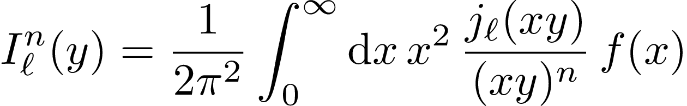

# 1D FFTlog in Python

Stupid simple implementation of the FFTlog algorithm in Python, first described in [Hamilton, 2000][hamilton].

In essence, the code computes the following integral:



or, in Latex (in case the above doesn't display properly):

```plaintext
I_\ell^n(y)
=
\frac{1}{2 \pi^2}
\int_0^\infty
\text{d}x\,
x^2\,
\frac{j_\ell(x y)}{(x y)^n}\,
f(x)
```

where `j_\ell` are the spherical Bessel functions of degree `\ell`, and `f(x)` is the input function, usually taken to be the [matter power spectrum][power-spectrum].

Code is heavily based on [twoFAST.jl][twofast-repo], and has been verified with their implementation on the reference [power spectrum][twofast-data].

# Installation

Clone the repo:

```bash
git clone https://github.com/JCGoran/repo
```

You need the `numpy` and `scipy` packages for the FFTlog module to work.

You can install them using `pip` from the `requirements.txt` file:

```bash
pip3 install -r requirements.txt
```

You can add a `--user` flag to the above if you don't want to install those packages system-wide.

# Usage

See the provided `example.py` file; note that it needs the `matplotlib` package to perform the plotting.

An abridged version would be:

1. Import the module:

```python
import fftlog
```

2. Input: two arrays, `x`, and `f(x)`; `f(x)` must be sampled on a large enough range of `x`, otherwise spurious oscillations may appear in the output.

3. To create an FFTlog:

```python
# prepares the FFTlog with ell = 0, n = 0, with 2048 sampling points
result = fftlog.FFTlog(x, y, 0, 0, 2048)

# performs the transformation in place with min(y_output) = 1
result.transform(1)
# alternatively, you can instead directly assign the output with:
# x_transform, y_transform = result.transform(1)
```

# License

GPL 3.0

# TODO

Make PyPI package.

[hamilton]: https://arxiv.org/abs/astro-ph/9905191
[twofast-repo]: https://github.com/hsgg/twoFAST.jl
[power-spectrum]: https://en.wikipedia.org/wiki/Matter_power_spectrum
[twofast-data]: https://github.com/hsgg/TwoFAST.jl/blob/master/test/data/planck_base_plikHM_TTTEEE_lowTEB_lensing_post_BAO_H070p6_JLA_matterpower.dat
